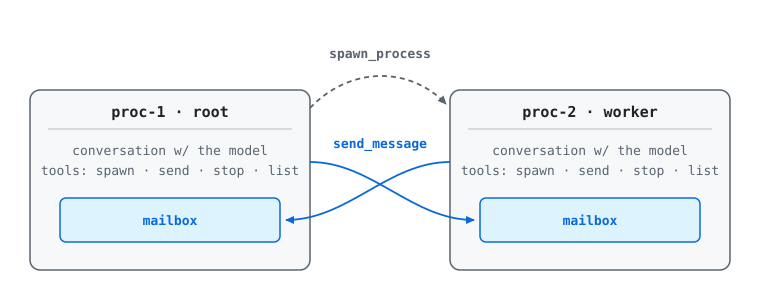

# Bitty

An agent meta-harness built on the **actor model**. Every agent is an actor: a **process** with an address, private state (its own conversation with the model), and a **mailbox**. Processes share nothing — the only ways to interact are to **spawn** a new process or **send** a message to an address you know, and both are exposed to the model as tools. Incoming mail is injected mid-task, between tool calls — the same UX as interrupting a coding agent while it works.



Processes come in two flavors: **agents** (a model conversation) and **scripts** (TypeScript actors on an embedded Deno runtime — same mailbox, same permissions, zero API tokens). Use agents for judgment and scripts for the mechanical parts: routing, aggregation, validation.

## Why

Single-agent harnesses hit a wall: one context window, one train of thought, one thing at a time. The actor model is the classic answer to exactly this shape of problem, and the properties that made it work for Erlang/OTP transfer directly to agents: **concurrency without shared state** (each process has its own context, so nothing steps on anything), **failure isolation** (a dead process signals its links with a message instead of taking anyone down with it), and **supervision** (spawners learn about their children's deaths and can re-plan or respawn). Bitty hands these primitives to the model itself — spawn, send, link, stop — and the agents decide how to organize.

That turns out to enable systems that run indefinitely, not just tasks that finish:

- **long-running services** — a script actor can serve HTTP from inside the system, so a swarm can host something rather than just produce an artifact and exit;
- **self-maintaining projects** — give one agent ownership of a codebase or document and let others file requests through its mailbox;
- **pipelines and fan-out** — writer → editor chains, parallel research workers reporting back to a coordinator;
- **safe delegation** — each process holds only the files, peers, and permissions it was granted, and can never grant a child more than it has, so untrusted subtasks stay contained.

## How it works

- Each process runs its own agentic loop as a tokio task, with an mpsc channel as its mailbox. Mail is injected between tool calls; an idle process blocks until woken.
- **Capabilities:** grants for `Send` / `Stop` / `Spawn` are clamped so a child can never hold authority its spawner lacks. Visibility follows authority — an isolated worker can't even enumerate its siblings.
- **Links:** a dying process signals its spawner (as mail, never a kill), OTP-style, so coordinators can re-plan or respawn.
- **Topologies:** `spawn_topology` wires a whole group at once, with per-node roles, models, and `can_send_to` allowlists.
- **Tool aliases:** spawns can define typed tools that route to another actor; arguments are schema-validated before delivery, and an alias may only target a process the holder could already message — a tool is never a way around the capability model.
- **Cost controls:** per-process model and effort — including mixing providers, so a Claude coordinator can run ChatGPT workers or vice versa — plus low-priority mail that never wakes anyone, a shared prompt-cache prefix across the whole system, and server-side compaction per process.

See the source for the full details — `src/agent.rs` (the loop), `src/grants.rs` (capabilities), `src/actions.rs` (the shared policy layer).

## Install & use

```bash
git clone https://github.com/by77er/Bitty && cd Bitty
export ANTHROPIC_API_KEY=sk-ant-...

cargo run -- "Research X with two parallel workers and summarize."
cargo run -- --role "You coordinate a writing pipeline." "Draft a page on actor systems."
```

The console is wired into the actor system while it runs:

| Input | Effect |
| --- | --- |
| plain text | mailed to the root process (interrupts it mid-task) |
| `@proc-3 message` | mail a specific process (`@*` to fan out) |
| `/ps`, `/graph` | process list / supervision tree |
| `/stop proc-2 [--cascade]` | stop processes |
| `/quit` | exit |

Filesystem access starts empty and is granted from the CLI (`--allow-read ./repo --allow-write ./repo`); the root process can narrow grants per child. Network and subprocess execution are not implemented.

Config: `BITTY_MODEL` (default `claude-opus-5`; ChatGPT models are also supported, per-process or system-wide), `ANTHROPIC_BASE_URL`, `BITTY_COMPACTION=off`. Use `--once` to exit when everything is idle. To test without an API key, point `ANTHROPIC_BASE_URL` at any mock server speaking the Messages API SSE format.
