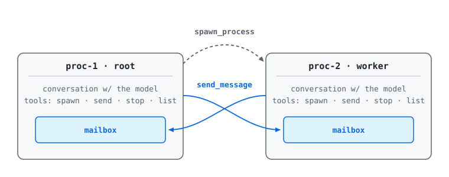

# Bitty

Bitty runs a team of AI agents that work at the same time and talk to each
other by sending messages.

Each agent is its own process, with its own conversation and its own inbox.
Agents share nothing. To work together, they start new agents or send each
other mail, using tools the model can call. Mail arrives while an agent is
working, between tool calls, the way you might interrupt someone mid-task.



This is the actor model, the idea behind Erlang, applied to agents. It gives
you a few useful things for free:

- **Parallel work.** Many agents can work at once, each with a full context
  window of its own.
- **Contained failures.** If an agent dies, the agent that started it gets a
  message instead of crashing too, and can retry or change plans.
- **Safe delegation.** An agent can only give a new agent permissions it
  already has, never more.

Not every job needs a model. A process can also be a TypeScript **script**
that runs in Bitty's built-in Deno runtime. It has the same inbox and
permissions as an agent, and uses no tokens. Scripts can route mail, check
results, or run a web server.

## Install

```bash
git clone https://github.com/by77er/Bitty && cd Bitty
cargo install --path .
```

Bitty needs a nightly Rust toolchain. `rust-toolchain.toml` pins one, and
rustup downloads it the first time you build.

## Usage

```bash
export ANTHROPIC_API_KEY=sk-ant-...   # or put it in .env

bitty "Research X with two parallel workers and summarize."
bitty --tui --allow-read . --allow-write . "Refactor the parser and keep the tests green."
bitty --once --gate "cargo test" "Fix the failing parser tests."
bitty --resume                        # pick up where the last session left off
```

Bitty denies everything by default. Permissions work like Deno's: leave a flag
out to deny, pass it bare to allow everything, or give it values to allow only
those.

| Flag | Allows |
| --- | --- |
| `--allow-read[=PATHS]` | reading files |
| `--allow-write[=PATHS]` | writing files |
| `--allow-run[=PROGRAMS]` | running programs |
| `--allow-net[=HOSTS]` | network access |
| `--allow-env[=NAMES]` | reading environment variables |
| `--allow-sys[=KEYS]` | reading system information |
| `-A` | all of the above |

Other options:

- `--tui` opens a full-screen dashboard with the conversation, a tree of
  processes, and what each one costs.
- `--once` exits when every process has finished.
- `--gate CMD` (with `--once`) won't let the run finish until `CMD` passes. A
  failure is sent back to the agents as more work.
- `--max-tokens N` tells the agents to wrap up after spending `N` tokens.
- `--role TEXT` sets the root agent's system prompt.

`bitty --help` lists everything.

While Bitty runs, you can type to it:

| Input | Does |
| --- | --- |
| any text | sends a message to the root agent |
| `@proc-3 message` | sends a message to one process (`@*` for all) |
| `/ps`, `/graph` | lists processes, or shows who started whom and who can message whom |
| `/model proc-2 small` | switches a process to a different model size |
| `/stop proc-2` | stops a process (`--cascade` stops its children too) |
| `/quit` | exits |

## How it works

Agents get a small set of tools: start one process or a connected group, send
mail, call a process and wait for its reply, read long mail, stop processes,
and list them. An agent only sees the tools its permissions allow.

Each agent also has a TypeScript workspace that stays alive for its whole life.
It can run code there with its own permissions, keep data in variables between
calls, and use two built-in helpers: `sh()` runs a shell command and `read()`
reads lines from a file. Big results stay in the workspace, and the agent gets
a short preview, so they don't fill up its context.

A few things keep costs down:

- Models come in three sizes, and each agent can use a different one. By
  default the root agent uses the large model at high effort, and the agents
  it starts use low effort unless asked otherwise.
- Low-priority mail waits until the recipient is awake instead of waking it.
- Long mail is stored and read in pages instead of being pasted into context.
- All agents share the same cached system prompt and tool list.

Interactive runs are saved under `.bitty/sessions/`. `bitty --resume` brings
back every process with its conversation, permissions, and unread mail.
`--once` runs aren't saved.

## Configuration

Bitty uses Anthropic by default. Set `BITTY_PROVIDER=codex` to use your
ChatGPT account through the Codex CLI's login (`~/.codex/auth.json`) instead.
One run uses one provider.

| Size | Anthropic | Codex |
| --- | --- | --- |
| `small` | `claude-haiku-4-5` | `gpt-5.6-luna` |
| `medium` | `claude-sonnet-5` | `gpt-5.6-terra` |
| `large` | `claude-opus-5` | `gpt-5.6-sol` |

| Variable | Purpose |
| --- | --- |
| `ANTHROPIC_API_KEY` or `ANTHROPIC_AUTH_TOKEN` | Anthropic credentials |
| `ANTHROPIC_BASE_URL` | a different Anthropic-compatible endpoint |
| `BITTY_PROVIDER` | `codex` to use ChatGPT |
| `BITTY_MODEL` | the root agent's model size (default `large`) |
| `BITTY_COMPACTION` | `off` to turn off server-side context compaction |
| `BITTY_PRICES` | your own per-model prices, as JSON |
| `BITTY_PRICE_FETCH` | `off` to skip fetching current prices from OpenRouter |

Bitty loads `.env` on startup, but agents can't read those variables unless you
allow them with `--allow-env`.

## Development

```bash
cargo test
cargo build && test/run_suite.sh   # multi-agent scenarios against mock servers (needs python3)
```

The mock servers speak the Anthropic API, so none of this needs an API key. See
[test/README.md](test/README.md).

The main pieces are in `src/`: `agent.rs` (the agent loop and its tools),
`system.rs` (processes and supervision), `script.rs` (the Deno runtime),
`grants.rs` (permissions), and `durable.rs` (saved sessions).
